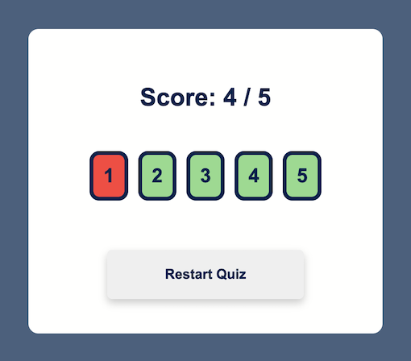

# Maths Challenge

A Maths quiz app for teachers, tutors and students, based on the annual Maths Challenge competitions by The UK Maths Trust.

Demo Link: https://eloise-weeks.github.io/maths-challenge-react/

## Overview

Click 'Start Quiz' to navigate to the first of five questions:

Then answer each one to reveal your final score:

## How It Works

### `Built with Javascript, HTML, CSS and React`

Components: 
* Main Menu
* Quiz
* End Screen

React useState hook and event handler functions used:
* to navigate between components and questions based on user interactions;
* to store the answers chosen by the user for scoring functionality and CSS styling.

React Context API used:
* to share data between each component (i.e. answer selected and current score).